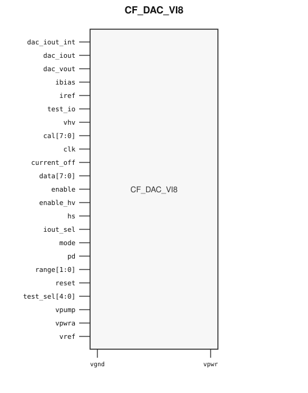

# CF_DAC_VI8

> 8-bit Voltage/Current DAC

Draft for designer review. The public GDS is an abstract; ChipFoundry
substitutes protected full geometry at tapeout.

This package ships an SRAM-style PG wrap `CF_DAC_VI8` around analog leaf
`CF_DAC_VI8_core`.

## Overview

`CF_DAC_VI8` is a SkyWater 130 nm hard macro that generates a monotonic
8-bit voltage or current output. Instantiate `CF_DAC_VI8`.

Macro size is 338.06 × 353.59 µm (15 µm halo around analog leaf
308.06 × 323.59 µm). Customer PG for chip PDN is `vpwr` / `vgnd` (vendor
`vpwrd` / `vgnd`). Analog supplies `vpwra`, `vpump`, and `vhv` stay wrap
ports and are routed as signals. Well tap `vnb` is tied inside the wrap.

## Installation

```bash
pip install cf-ipm
ipm install CF_DAC_VI8 --version 0.2.0 --include-drafts
```

Until the marketplace listing is published, install from a local catalog
override:

```bash
ipm install CF_DAC_VI8 --version 0.2.0 --include-drafts --local-file ip/catalog.json
```

Use `hdl/gl/CF_DAC_VI8.v` as the customer blackbox, `layout/lef/CF_DAC_VI8.lef`
for P&R, and `layout/gds/CF_DAC_VI8.gds` / `layout/mag/CF_DAC_VI8.mag` for the
public wrap. `CF_DAC_VI8_core` is the analog leaf (empty Verilog, pin-only
abstract). ChipFoundry substitutes vault GDS into `CF_DAC_VI8_core` at tapeout.
P&R uses the wrap LEF (`vpwr` / `vgnd` for chip PDN).

## Features

- Guaranteed monotonic 8-bit DAC (`data[7:0]`, 255 steps)
- Voltage output `dac_vout` and current outputs `dac_iout` / `dac_iout_int`
- Voltage or current mode (`mode`) with full-scale `range[1:0]`
- Source/sink current modes and `current_off`
- Calibration bus `cal[7:0]`
- Customer cell `CF_DAC_VI8` 338.06 × 353.59 µm (15 µm halo around analog leaf 308.06 × 323.59 µm)
- Chip PDN is `vpwr` / `vgnd`. Analog `vpwra` / `vpump` / `vhv` are wrap signal ports.

## Pinout

Customer documentation includes a pinout of the integration cell only.
Internal schematics and architecture block diagrams are not published.



Pin names and directions match the public wrap (`layout/lef/CF_DAC_VI8.lef`)
and the blackbox stub (`hdl/gl/CF_DAC_VI8.v`).

## Pin Description

Directions and widths are taken from the shipped Verilog in `hdl/gl/CF_DAC_VI8.v`.

| Name | Direction | Width | Description |
|---|---|---:|---|
| `dac_iout_int` | inout | 1 | Internal current output. |
| `dac_iout` | inout | 1 | Current output. |
| `dac_vout` | inout | 1 | Voltage output. |
| `ibias` | inout | 1 | Bias-current input. |
| `iref` | inout | 1 | Current reference. |
| `test_io` | inout | 1 | Analog test I/O. |
| `vhv` | inout | 1 | High-voltage analog supply. Route as a signal; not on chip PDN. |
| `cal` | input | 8 | Calibration code. |
| `clk` | input | 1 | Update clock. |
| `current_off` | input | 1 | Disable current output. |
| `data` | input | 8 | DAC input code. |
| `enable` | input | 1 | Enable. |
| `enable_hv` | input | 1 | High-voltage path enable. |
| `hs` | input | 1 | High-speed mode. |
| `iout_sel` | input | 1 | Current-output select. |
| `mode` | input | 1 | Voltage / current mode. |
| `pd` | input | 1 | Power-down. |
| `range` | input | 2 | Full-scale range select. |
| `reset` | input | 1 | Reset. |
| `test_sel` | input | 5 | Test mux select. |
| `vgnd` | input | 1 | Ground. |
| `vpump` | input | 1 | Charge-pump analog supply. Route as a signal; not on chip PDN. |
| `vpwra` | input | 1 | Analog supply. Route as a signal; not on chip PDN. |
| `vpwr` | input | 1 | Digital supply. |
| `vref` | input | 1 | Voltage reference. |

`CF_DAC_VI8_core` also has vendor digital `vpwrd` and well tap `vnb`. The wrap
ties `.vpwrd(vpwr)` and `.vnb(vgnd)`. Do not connect those pins at chip level.

In OpenLane / LibreLane, hook chip PDN with
`PDN_MACRO_CONNECTIONS: "u_cf_dac_vi8 vccd1 vssd1 vpwr vgnd"` and connect
`.vpwr(vccd1)`, `.vgnd(vssd1)` under `USE_POWER_PINS`. Do not list `vnb` /
`vpwrd` on the wrapper instance. Route `vpwra`, `vpump`, and `vhv` onto
`analog_io`.

## Limitations and Open Issues

- Verilog in `hdl/gl/CF_DAC_VI8.v` is a structural wrap around an empty
  `CF_DAC_VI8_core` blackbox, not a SPICE-accurate model.
- Liberty is not in this first wrap drop. P&R uses the wrap LEF.
- The chip-level integration top with empty public PIN PORTs is not shipped.
  This package is the working analog integration cell.
